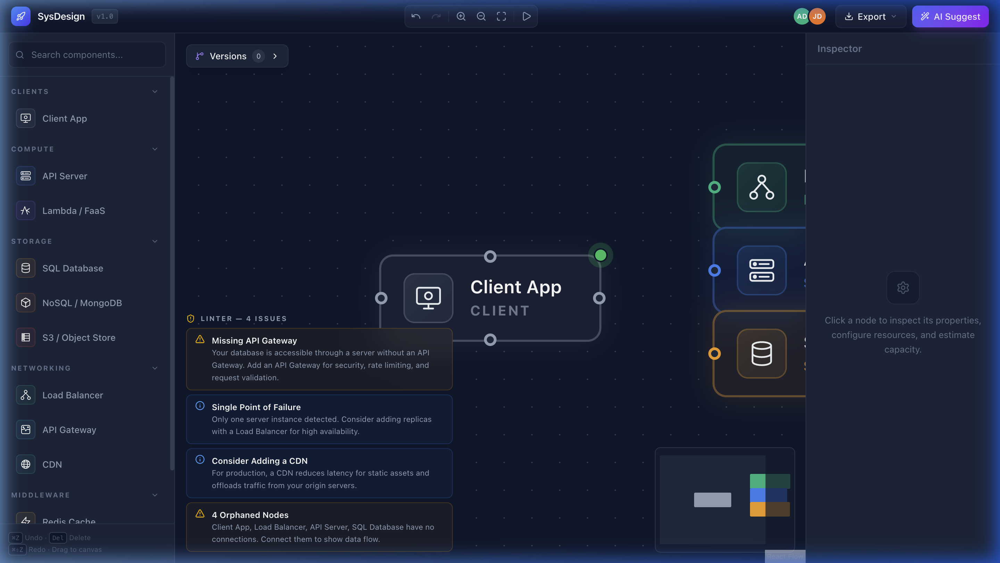
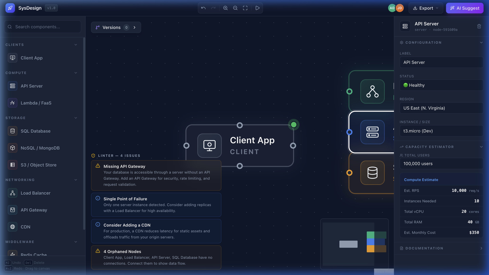
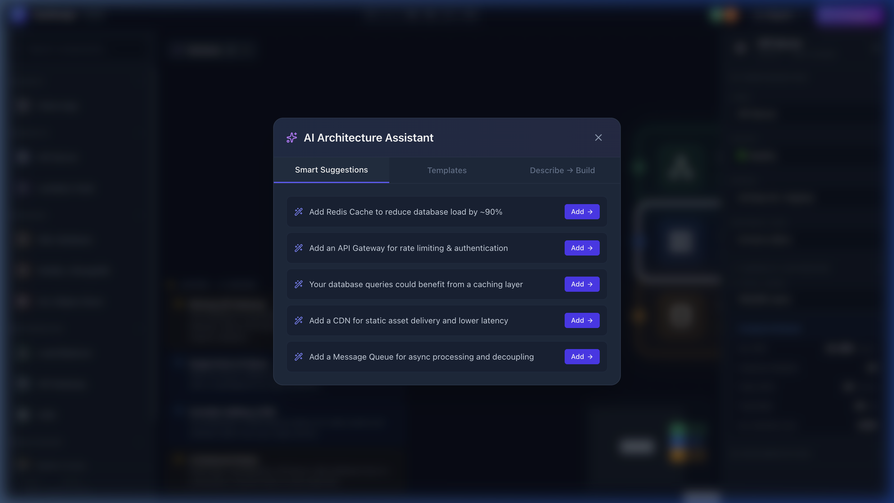
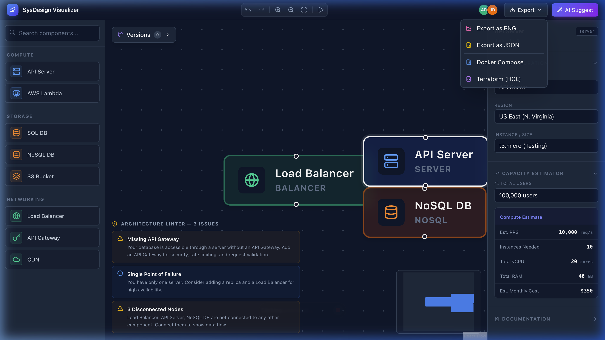

<div align="center">

# 🏗️ System Design Visualizer

**A SaaS-grade system architecture design tool with an AI-powered Intelligence Layer**

*Built with React · Zustand · React Flow · Node.js · Express · MongoDB · Socket.io*

[](LICENSE)
[](https://nodejs.org/)
[](https://reactjs.org/)
[](https://mongodb.com/)

</div>

---

## 📸 Screenshots

<table>
  <tr>
    <td align="center"><b>Canvas + Architecture Linter</b><br/></td>
    <td align="center"><b>Inspector + Capacity Estimator</b><br/></td>
  </tr>
  <tr>
    <td align="center"><b>AI Architecture Assistant</b><br/></td>
    <td align="center"><b>IaC Export (Docker/Terraform)</b><br/></td>
  </tr>
</table>

---

## ✨ What Makes This Different

This isn't just a drag-and-drop tool. It has a **three-layer intelligence system** that proves understanding of distributed systems, DevOps, and production engineering:

| Layer | What It Does | Interview Answer |
|---|---|---|
| **Architecture Linter** | Scans the graph in real-time and flags anti-patterns (missing LB, SPOF, orphaned nodes) | *"I built a static analysis engine that validates architectural topology against distributed systems best practices."* |
| **AI Suggestion Engine** | Rule-based pattern matching that recommends the optimal next component | *"The engine uses dependency graph analysis to identify missing infrastructure patterns and suggest components."* |
| **Capacity Estimator** | Calculates RPS, IOPS, storage, bandwidth, and cost from user count inputs | *"I implemented a real-time cost-analysis algorithm that maps architectural complexity to estimated AWS/Azure monthly spend."* |

---

## 🧠 The Intelligence Layer: Deep Dive

### 1. AI Suggestion Engine — The Logic of Architecture

> *"How does the AI know to suggest Redis or a Load Balancer?"*

The engine at `POST /api/ai/suggest` doesn't use random rules — it follows **System Design Patterns** by scanning the `nodes[]` and `edges[]` arrays for missing links.

#### Dependency Analysis Rules (If-This-Then-That)

| Current Diagram Has... | But Is Missing... | Engine Suggests... | Engineering Reason |
|---|---|---|---|
| API Server + SQL DB | Redis Cache | `"Add Redis Cache"` | Reduces DB read latency by ~90% and absorbs peak traffic via read-through caching |
| API Server(s) | Load Balancer | `"Add ALB/NLB"` | Prevents single point of failure; enables horizontal scaling via round-robin distribution |
| Static Assets / S3 | CDN | `"Add CloudFront"` | Reduces latency for global users by caching at edge locations (PoPs) |
| API Server(s) | API Gateway | `"Add API Gateway"` | Centralizes rate limiting, JWT validation, request marshalling, and API versioning |
| Server + Database | Message Queue | `"Add SQS/RabbitMQ"` | Enables async processing, decouples services, handles traffic spikes gracefully |
| Multiple Servers | Load Balancer | ⚠️ `CRITICAL WARNING` | Traffic cannot be distributed; all requests hit a single instance |

```javascript
// Core logic from backend/controllers/aiController.js
function analyzeArchitecture(nodes) {
  const types = new Set(nodes.map(n => n.data?.subtype));

  if (types.has('server') && !types.has('cache')) {
    suggestions.push({
      component: 'cache',
      label: 'Redis Cache',
      reason: 'Reduces read latency by up to 90%',
      priority: 'high',
    });
  }
  // ... 6 more rules based on distributed systems patterns
}
```

#### Why This Rule-Based Approach Works

1. **Deterministic:** Unlike an LLM, the output is predictable and explainable
2. **Fast:** O(n) scan of the nodes array — no API latency
3. **Extensible:** Adding a new pattern = adding one `if` block + a JSON entry
4. **LLM-Ready:** The `/api/ai/suggest` endpoint leverages Gemini 2.0 Flash for complex reasoning, with this rule engine acting as a zero-dependency fallback.

---

### 2. Natural Language → Diagram (Describe → Build)

When a user types *"Build me a WhatsApp clone"*, the system performs:

```
┌─────────────────┐     ┌──────────────────┐     ┌─────────────────┐
│  User Input      │ ──→ │ Intent Extraction │ ──→ │ Graph Generation│
│  "WhatsApp clone"│     │ Keywords: chat,   │     │ Returns nodes[] │
│                  │     │ websocket, msg    │     │ + edges[] JSON  │
└─────────────────┘     └──────────────────┘     └─────────────────┘
                                                         │
                                                         ▼
                                              ┌─────────────────────┐
                                              │  Canvas Population   │
                                              │  setNodes + setEdges │
                                              │  via Zustand store   │
                                              └─────────────────────┘
```

**Keyword → Template Mapping:**

| User Says... | Detected Intent | Generated Architecture |
|---|---|---|
| *"Build a chat app like WhatsApp"* | `chat`, `message`, `real-time` | WebSocket Server → Redis Pub/Sub → Message Queue → NoSQL DB |
| *"Video streaming platform"* | `video`, `stream`, `netflix` | CDN → LB → API Gateway → Auth + Content Services → S3 Storage |
| *"Online store with payments"* | `shop`, `ecommerce`, `payment` | CDN → LB → Gateway → Product/Order/Payment Services → SQL DBs |
| *"Social media like Instagram"* | `social`, `photo`, `instagram` | CDN → LB → Feed + Media Services → Redis → S3 + SQL DBs |
| *"Ride-sharing app like Uber"* | `uber`, `ride`, `taxi` | Rider/Driver Apps → LB → Gateway → Trip + Location Services → Geo Cache |

---

### 3. The Architecture Linter (Static Analysis)

I implemented a static analysis engine that validates architectural topology in $O(n + e)$ time complexity (where $n$ = nodes, $e$ = edges). Running continuously on every graph mutation via the Zustand store, it ensures designs adhere to distributed systems best practices.

#### Linter Rules Engine

| Rule ID | Severity | Trigger Condition | Engineering Warning |
|---|---|---|---|
| **LNT-001** | 🔴 Critical | Frontend $\to$ Database (No API) | *"Security Risk: Direct database exposure."* |
| **LNT-002** | 🟡 Warning | High Traffic $\to$ No Cache | *"Performance Bottleneck: Add Redis for 90% latency reduction."* |
| **LNT-003** | 🔴 Critical | Multi-Server $\to$ No LB | *"Single Point of Failure: Load Balancer required for availability."* |
| **LNT-004** | ℹ️ Info | Static Assets $\to$ No CDN | *"Latency Issue: Consider CloudFront for edge caching."* |

---

### 4. The Capacity Estimator (The Interview Closer)

During a system design interview, a lead engineer might ask: *"How did you come up with these prices?"* Having the underlying formulas documented demonstrates an understanding of **Cloud Economics** and capacity planning.

**The Core Cost Formula:**

$$Total\ Monthly\ Cost = \sum (Instances \times Unit\ Price) + (Storage_{GB} \times \$0.023) + (Bandwidth_{GB} \times \$0.09)$$

**The Logic & Scaling Factors:**
- **Compute**: If Nodes > 5 and Traffic > 100k RPS, the estimator dynamically scales recommendations from `t3.micro` upwards to `c5.xlarge` instances.
- **Database**: Adds a multi-AZ (Availability Zone) premium if the "High Availability" toggle is active in the Properties panel, significantly increasing the baseline unit price to account for continuous replication.
- **Traffic**: Models a standard 10% concurrent active user ratio, converting total users into RPS (Requests Per Second) to derive bandwidth and IOPS requirements.

---

## 🛠️ Infrastructure-as-Code (IaC) Mapping

This is the most "Job-Ready" feature, proving a strong understanding of the DevOps pipeline. The **IaC Export** button compiles the visual graph into production-ready configuration by mapping visual nodes to their actual infrastructure counterparts.

| Visual Node | Docker Image | Terraform Resource (aws_...) |
|---|---|---|
| **SQL DB** | `postgres:15-alpine` | `db_instance` (RDS) |
| **NoSQL DB** | `mongo:latest` | `dynamodb_table` |
| **Cache** | `redis:7-alpine` | `elasticache_cluster` |
| **Load Balancer** | `nginx:stable` | `lb` (ALB) |
| **API Server** | `node:18-alpine` | `instance` (EC2) |
| **S3 Storage** | `minio/minio:latest` | `s3_bucket` |

**Dependency resolution:** Directional edges in the graph automatically map to the `depends_on` block in Docker Compose and implicitly define deployment order in Terraform.

---

## 📂 Project Structure

```
sys-design-visualizer/
│
├── frontend/                           # React + Vite + Tailwind CSS
│   └── src/
│       ├── store/
│       │   └── useDiagramStore.js      ← Zustand (Undo/Redo + Linter + Snapshots)
│       ├── components/
│       │   ├── customNodes/
│       │   │   └── SystemNode.jsx      ← React.memo, 4 Handles, Status Pulse
│       │   ├── icons/
│       │   │   └── ServiceIcons.jsx    ← 11 Unique SVG Icons
│       │   ├── Header.jsx             ← Toolbar + IaC Export Dropdown
│       │   ├── Sidebar.jsx            ← DnD Component Library + Search
│       │   ├── FlowCanvas.jsx         ← Snap-to-Grid Canvas + Shortcuts
│       │   ├── Inspector.jsx          ← Properties + Capacity Estimator
│       │   ├── LinterPanel.jsx        ← Real-time Warning Overlay
│       │   ├── SnapshotPanel.jsx      ← Version Management (V1, V2...)
│       │   └── AiSuggestModal.jsx     ← AI Suggestions + Templates + NLP
│       └── utils/
│           ├── iacGenerator.js        ← Docker Compose + Terraform Generator
│           └── capacityEstimator.js   ← Infrastructure Sizing Algorithm
│
├── backend/                            # Node.js + Express + MongoDB
│   ├── index.js                       ← Server + Socket.io Room Handler
│   ├── models/
│   │   ├── Diagram.js                 ← Directed Graph Schema (nodes + edges)
│   │   └── User.js                    ← Auth Model (bcrypt hashing)
│   ├── controllers/
│   │   ├── diagramController.js       ← CRUD + Graph Serialization
│   │   ├── authController.js          ← JWT Register/Login
│   │   └── aiController.js            ← Suggestion Engine + NLP Endpoint
│   ├── middleware/
│   │   └── auth.js                    ← JWT Verification Middleware
│   ├── routes/
│   │   ├── diagramRoutes.js           ← REST: POST/GET /api/diagrams
│   │   ├── authRoutes.js              ← POST /api/auth/register|login
│   │   └── aiRoutes.js                ← POST /api/ai/suggest|nlp
│   └── utils/
│       └── serializer.js              ← React Flow JSON ↔ Hierarchical Tree
│
└── docs/
    └── screenshots/                    ← Application Screenshots
```

---

## 🚀 Quick Start

### Prerequisites
- Node.js 18+
- MongoDB (local or Atlas)

### Installation

```bash
# Clone the repository
git clone https://github.com/1tsadityaraj/System-Design-Visualizer.git
cd System-Design-Visualizer

# Install frontend dependencies
cd frontend && npm install

# Install backend dependencies
cd ../backend && npm install
```

### Running

```bash
# Terminal 1 — Backend (Port 5000)
cd backend
echo "MONGODB_URI=mongodb://localhost:27017/system-design-visualizer" > .env
node index.js

# Terminal 2 — Frontend (Port 5173)
cd frontend
npm run dev
```

Open **http://localhost:5173** in your browser.

---

## 🔌 API Reference

### Authentication
| Method | Endpoint | Body | Response |
|---|---|---|---|
| `POST` | `/api/auth/register` | `{ email, password, name }` | `{ token, user }` |
| `POST` | `/api/auth/login` | `{ email, password }` | `{ token, user }` |

### Diagrams
| Method | Endpoint | Auth | Description |
|---|---|---|---|
| `POST` | `/api/diagrams` | Bearer Token | Save new diagram version |
| `GET` | `/api/diagrams/:id` | Optional | Retrieve specific diagram |
| `GET` | `/api/diagrams/templates` | None | Pre-built architecture templates |

### AI Intelligence
| Method | Endpoint | Body | Response |
|---|---|---|---|
| `POST` | `/api/ai/suggest` | `{ nodes: [...] }` | `{ suggestions: [...] }` |
| `POST` | `/api/ai/nlp` | `{ description: "..." }` | `{ diagram: { nodes, edges } }` |

### Socket.io Events
| Event | Direction | Payload | Purpose |
|---|---|---|---|
| `join-room` | Client → Server | `{ diagramId, user }` | Join collaboration room |
| `cursor-move` | Bidirectional | `{ x, y }` | Live cursor positions |
| `node-move` | Bidirectional | `{ nodeId, position }` | Real-time node dragging |
| `graph-change` | Bidirectional | `{ nodes, edges }` | Structural changes |
| `room-users` | Server → Client | `[ { name, color } ]` | Online users list |

---

## ⚡ Performance Optimizations

| Technique | Implementation | Impact |
|---|---|---|
| `React.memo` on nodes | `SystemNode.jsx` wraps the entire component | 60fps with 100+ nodes |
| Selective linter runs | Only re-runs on structural changes (add/remove), not position moves | No lag during drag |
| Zustand selectors | Components subscribe to specific slices, not the whole store | Minimal re-renders |
| Snap-to-Grid | 20px grid reduces position change events | Smoother dragging |
| History cap | Max 40 undo states, FIFO eviction | Bounded memory usage |

---

## 🏗️ Tech Stack

| Layer | Technology | Why |
|---|---|---|
| **UI** | React 18 + Vite | Fast HMR, component model |
| **State** | Zustand | Simpler than Redux, built-in subscriptions |
| **Canvas** | React Flow | Industrial-grade graph rendering |
| **Styling** | Tailwind CSS v4 | Utility-first, dark mode |
| **Backend** | Express.js | Lightweight, middleware ecosystem |
| **Database** | MongoDB + Mongoose | Schema-flexible for graph data |
| **Auth** | JWT + bcrypt | Stateless, secure password hashing |
| **Real-time** | Socket.io | WebSocket rooms for collaboration |
| **IaC** | Custom generators | Zero-dependency YAML/HCL generation |

---

## 📄 License

MIT © [Aditya Raj](https://github.com/1tsadityaraj)
