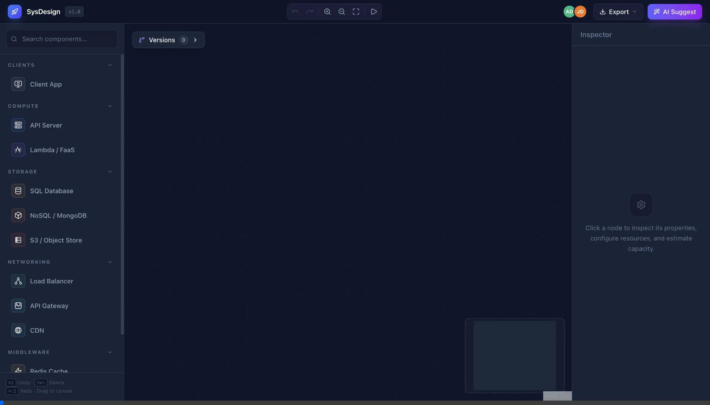
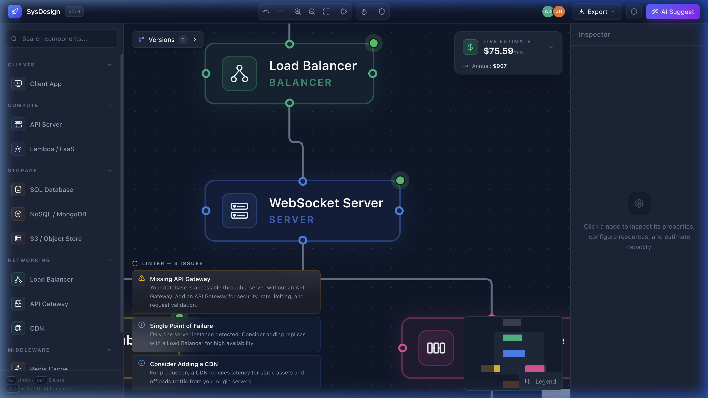
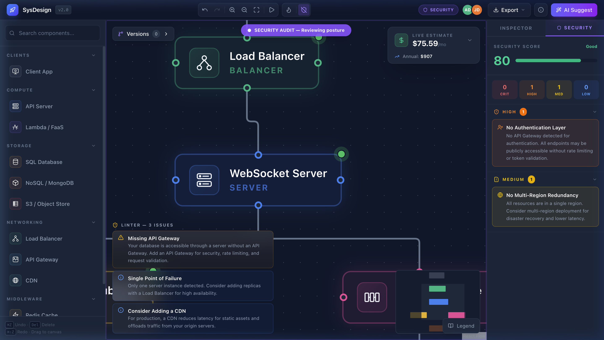
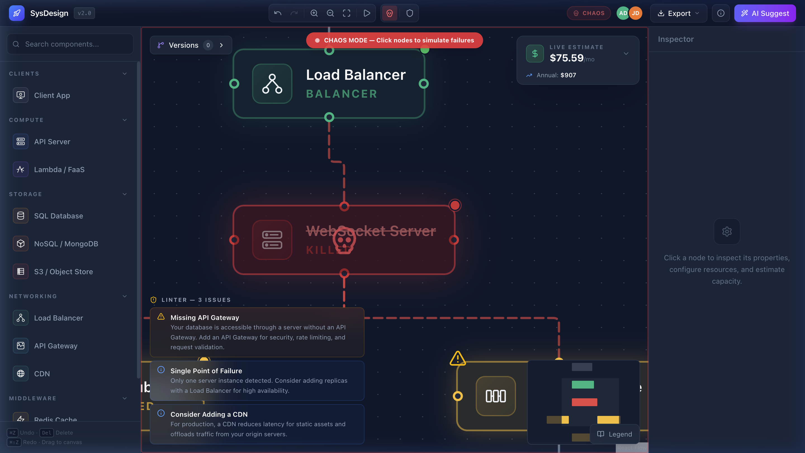
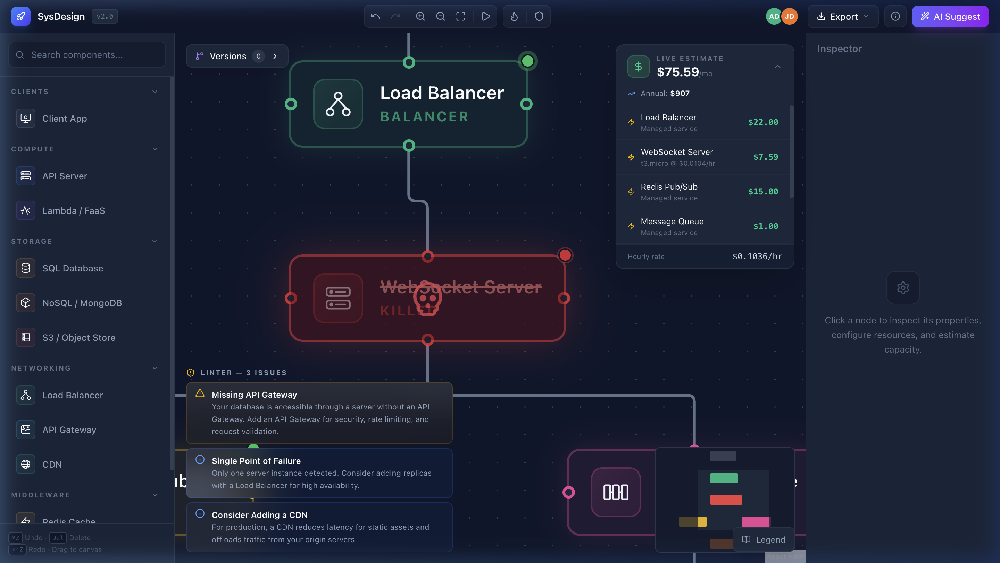
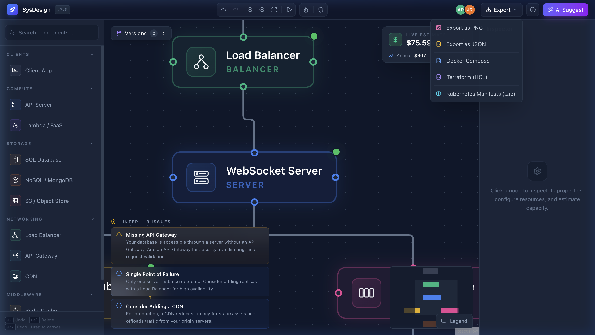

<div align="center">

# 🏗️ System Design Visualizer

**A SaaS-grade system architecture design tool with AI-powered Intelligence, Chaos Engineering, DevSecOps Audit, and Cloud Economics**

*Built with React · Zustand · React Flow · Node.js · Express · MongoDB · Socket.io*

[](LICENSE)
[](https://nodejs.org/)
[](https://reactjs.org/)
[](https://mongodb.com/)
[](#)

</div>

---

## 🚀 Live Deployments

- **Frontend (Vercel):** [https://frontend-gamma-six-56.vercel.app](https://frontend-gamma-six-56.vercel.app)
- **Backend API (Render):** [https://system-design-visualizer.onrender.com](https://system-design-visualizer.onrender.com)

---

## 🎬 Demo — Building the "Golden Path" Architecture

<div align="center">
  
  <p><i>Watch the static analysis linter clear out in real-time as the production-grade architecture is built — then explore Chaos, Security, and Cost modules below.</i></p>
</div>

---

## 📸 Screenshots

<table>
  <tr>
    <td align="center"><b>Canvas + Architecture Linter</b><br/></td>
    <td align="center"><b>🛡️ Security Posture Audit</b><br/></td>
  </tr>
  <tr>
    <td align="center"><b>💀 Chaos Engineering — Node Killed</b><br/></td>
    <td align="center"><b>💰 Live Bill + Cost Breakdown</b><br/></td>
  </tr>
  <tr>
    <td align="center"><b>📦 Enterprise Export (K8s + Terraform)</b><br/></td>
    <td align="center"><b>Inspector + Capacity Estimator</b><br/></td>
  </tr>
</table>

---

## ✨ What Makes This Different

This isn't just a drag-and-drop diagramming tool. It's a **five-layer engineering platform** that proves understanding of distributed systems, SRE, DevSecOps, Cloud Economics, and production-grade infrastructure:

| Layer | What It Does | The Signal It Sends |
|---|---|---|
| **Architecture Linter** | Real-time static analysis — flags anti-patterns (SPOF, missing LB, orphaned nodes) | *"I validate topology against distributed systems best practices in O(n+e) time."* |
| **Chaos Engineering** | Kill nodes, propagate failures, re-route traffic through replicas | *"I understand that systems fail — and I design for failover and high availability."* |
| **Cloud Economics** | Live monthly cost estimate with per-component AWS pricing breakdown | *"I can think about the bottom line — a 'cool' architecture is useless if it bankrupts the company."* |
| **Security Posture** | DevSecOps audit — scores architecture against 5 vulnerability rules | *"I have a Security-First mindset. I flag Direct DB Exposure as a critical risk."* |
| **Enterprise Exports** | Generates K8s manifests (Deployment, Service, Ingress, HPA) + Terraform HCL with variables | *"I'm production-ready. I understand container orchestration, IaC, and scaling."* |

---

## 🔥 v2.0 — The "Grand Architect" Expansion

### 1. 💀 Chaos Engineering Simulator (SRE Focus)

> *Most student projects assume everything works perfectly. This one proves you understand that systems **fail**.*

**How it works:**
- Toggle **Chaos Mode** via the skull button in the toolbar
- **Click any node** to "kill" it — visually turns red with a skull overlay and "KILLED" status
- **Graph Propagation (BFS):** If a replica exists (same subtype), traffic automatically re-routes through green dashed edges
- **No replica?** All downstream nodes turn **yellow (DEGRADED)**, clients turn **red (DOWN)**
- Dead edges render as **red dashed lines** with reduced opacity
- **Exit chaos mode** → all nodes instantly restore to healthy

**The SRE Signal:** Demonstrating graph propagation shows you understand **Load Balancing Algorithms**, **High Availability (HA)**, and **Failover Patterns** — the same patterns used by PagerDuty's service dependency graphs.

---

### 2. 💰 Cloud Economics Engine (Financial Intelligence)

> *Engineers who understand money are rare. This feature proves you can think about the bottom line.*

**The Cost Formula:**

$$Total\ Cost = \sum_{i=1}^{n} (Instance_{i} \times Rate_{i} \times 730h) + \sum_{e \in edges} (CrossRegionGB \times \$0.02) + ManagedServices$$

**What it calculates:**

| Component | Pricing |
|-----------|---------|
| EC2 instances | Mock AWS rates: `t3.micro` ($0.0104/hr) → `r5.xlarge` ($0.252/hr) |
| Managed services | Fixed monthly: RDS ($25), ElastiCache ($15), SQS ($1), etc. |
| Cross-region penalty | $0.02/GB + latency penalty when nodes span regions |
| Lambda | $0.20 per million invocations |

The **floating Live Bill** widget updates instantly as you add/remove/modify nodes, showing monthly total, annual projection, and hourly rate.

---

### 3. 🛡️ Security Posture Overlay (DevSecOps)

> *Your "Security Score" and critical rules are exactly what senior engineers look for in code reviews.*

**Security Rules Engine:**

| Rule | Severity | Trigger | Why It Matters |
|------|----------|---------|----------------|
| Direct DB Exposure | 🔴 **CRITICAL** | Client → Database without backend | Violates network isolation; exposes data layer |
| No API Gateway/WAF | 🟠 **HIGH** | Client → Server without Gateway | No rate limiting, no request validation |
| No Authentication | 🟠 **HIGH** | Servers + Clients but no Gateway | All endpoints publicly accessible |
| No Encryption (TLS) | 🟡 **MEDIUM** | Server → DB without TLS indicators | Data in transit is vulnerable to MITM attacks |
| Single Region | 🟡 **MEDIUM** | All nodes in one region | No disaster recovery; single point of failure |

**Features:**
- **Security Score** (0–100) with color-coded progress bar
- **Severity grid** showing CRIT/HIGH/MED/LOW counts at a glance
- **Edge highlighting:** Critical = pulsing red with glow, High = orange, Medium = yellow
- **Node badges** showing vulnerability count per component

---

### 4. 📦 Enterprise-Scale Exports (Production Ready)

> *Generating a `.zip` with `deployment.yaml`, `service.yaml`, and `hpa.yaml` is the ultimate "I'm ready for production" signal.*

| Export Type | What's Generated | Recruiter Value |
|---|---|---|
| **Kubernetes (.zip)** | `deployment.yaml`, `service.yaml`, `ingress.yaml`, `hpa.yaml` per component + `namespace.yaml` + `all-in-one.yaml` + `README.md` | **Extreme** — Container orchestration & scaling |
| **Terraform (HCL)** | Clean HCL with `variable` blocks, `sensitive` flags for passwords, S3 backend, ACM cert refs, and proper resource tagging | **Extreme** — Infrastructure as Code |
| **Docker Compose** | Multi-service YAML with networks, volumes, and dependency resolution | **Standard** — Local dev environments |

**K8s specifics:**
- Servers → `Deployment` with **HPA** (auto-scale 2–10 replicas at 70% CPU)
- Databases → `StatefulSet` with `volumeClaimTemplates` and `secretKeyRef` for credentials
- Gateways → `Ingress` with TLS termination and cert-manager annotations
- Health probes: `livenessProbe` + `readinessProbe` on every container

**Terraform specifics:**
- `db_password` marked as `sensitive = true` (won't echo in `terraform plan`)
- S3 backend for remote state management
- Variables for `instance_type`, `region`, `acm_certificate_arn`, subnet IDs

---

### 5. 🌐 Multi-Region Visualization

- Nodes display **region badges** (US-E, US-W, EU, APAC)
- **Cross-region edges** render as **dashed, pulsing purple lines**
- Cost engine applies **data transfer penalties** between regions
- Inspector allows configuring region and instance size per node

---

## 🧠 The Intelligence Layer (v1.0)

### AI Suggestion Engine

> *"How does the AI know to suggest Redis or a Load Balancer?"*

The engine scans the `nodes[]` and `edges[]` arrays for missing architectural patterns:

| Current Diagram Has... | But Is Missing... | Engine Suggests... | Engineering Reason |
|---|---|---|---|
| API Server + SQL DB | Redis Cache | `"Add Redis Cache"` | Reduces DB read latency by ~90% via read-through caching |
| API Server(s) | Load Balancer | `"Add ALB/NLB"` | Prevents SPOF; enables horizontal scaling |
| Static Assets / S3 | CDN | `"Add CloudFront"` | Reduces global latency from ~300ms to <20ms |
| API Server(s) | API Gateway | `"Add API Gateway"` | Centralizes rate limiting, JWT validation, API versioning |
| Server + Database | Message Queue | `"Add SQS/RabbitMQ"` | Enables async processing, decouples services |

### Natural Language → Diagram

```
User Input: "Build me a WhatsApp clone"
     ↓
Intent Extraction: [chat, websocket, real-time, message]
     ↓
Graph Generation: WebSocket Server → Redis Pub/Sub → Message Queue → NoSQL DB
     ↓
Canvas Population: setNodes + setEdges via Zustand store
```

| User Says... | Generated Architecture |
|---|---|
| *"Chat app like WhatsApp"* | WebSocket Server → Redis Pub/Sub → Message Queue → NoSQL DB |
| *"Video streaming platform"* | CDN → LB → Gateway → Content Services → S3 Storage |
| *"Online store with payments"* | CDN → LB → Gateway → Product/Order/Payment Services → SQL DBs |
| *"Social media like Instagram"* | CDN → LB → Feed + Media Services → Redis → S3 + SQL DBs |

### Architecture Linter (Static Analysis)

Real-time validation engine that acts as a "Reliability Engineer" — verifies architectural topology in $O(n + e)$ time using **DFS reachability checks**:

| Rule ID | Severity | Trigger | Warning |
|---|---|---|---|
| **LNT-001** | 🔴 Critical | Frontend → Database (direct) | *"Security Risk: Direct database exposure."* |
| **LNT-002** | 🟡 Warning | High Traffic → No Cache | *"Performance Bottleneck: Add Redis."* |
| **LNT-003** | 🔴 Critical | Multi-Server → No LB | *"SPOF: Load Balancer required."* |
| **LNT-004** | ℹ️ Info | Static Assets → No CDN | *"Latency Issue: Consider CloudFront."* |

### Capacity Estimator

$$Total\ Monthly\ Cost = \sum (Instances \times Unit\ Price) + (Storage_{GB} \times \$0.023) + (Bandwidth_{GB} \times \$0.09)$$

The estimator dynamically scales recommendations from `t3.micro` → `c5.xlarge` based on user count inputs (1K → 10M users).

---

## 🛠️ IaC Node Mapping

| Visual Node | Docker Image | Terraform Resource | K8s Kind |
|---|---|---|---|
| **SQL DB** | `postgres:15-alpine` | `aws_db_instance` (RDS) | `StatefulSet` |
| **NoSQL DB** | `mongo:7` | `aws_docdb_cluster` | `StatefulSet` |
| **Cache** | `redis:7-alpine` | `aws_elasticache_cluster` | `Deployment` |
| **Load Balancer** | `nginx:alpine` | `aws_lb` (ALB) | `Service` (LoadBalancer) |
| **API Server** | `node:18-alpine` | `aws_instance` (EC2) | `Deployment` + `HPA` |
| **API Gateway** | `kong:latest` | `aws_api_gateway_rest_api` | `Deployment` + `Ingress` |
| **S3 Storage** | `minio/minio:latest` | `aws_s3_bucket` + versioning + SSE | — |
| **CDN** | `nginx:alpine` | `aws_cloudfront_distribution` | — |
| **Lambda** | `aws-lambda-nodejs:18` | `aws_lambda_function` | `Deployment` |
| **Message Queue** | `rabbitmq:3-management` | `aws_sqs_queue` | `Deployment` |

---

## 📂 Project Structure

```
sys-design-visualizer/
│
├── frontend/                             # React + Vite + Tailwind CSS
│   └── src/
│       ├── store/
│       │   └── useDiagramStore.js        ← Zustand (Undo/Redo + Linter + Chaos + Security + Cost)
│       ├── components/
│       │   ├── customNodes/
│       │   │   └── SystemNode.jsx        ← React.memo, Chaos/Security Visuals, Region Badges
│       │   ├── overlays/
│       │   │   ├── LiveBill.jsx          ← Floating Cloud Economics Widget
│       │   │   ├── SecurityPanel.jsx     ← Security Audit Panel (Score + Findings)
│       │   │   └── Legend.jsx            ← Professional Tabbed Legend
│       │   ├── icons/
│       │   │   └── ServiceIcons.jsx      ← 11 Unique SVG Icons
│       │   ├── Header.jsx               ← Toolbar + Chaos/Security Toggles + K8s Export
│       │   ├── Sidebar.jsx              ← DnD Component Library + Search
│       │   ├── FlowCanvas.jsx           ← Canvas + Cross-Region Edges + Mode Overlays
│       │   ├── Inspector.jsx            ← Properties + Capacity + Security Tab
│       │   ├── LinterPanel.jsx          ← Real-time Warning Overlay
│       │   ├── SnapshotPanel.jsx        ← Version Management (V1, V2...)
│       │   └── AiSuggestModal.jsx       ← AI Suggestions + Templates + NLP
│       └── utils/
│           ├── iacGenerator.js           ← Docker + Terraform + K8s Manifest Generator
│           └── capacityEstimator.js      ← Infrastructure Sizing Algorithm
│
├── backend/                              # Node.js + Express + MongoDB
│   ├── index.js                          ← Server + Socket.io Room Handler
│   ├── models/
│   │   ├── Diagram.js                    ← Directed Graph Schema (nodes + edges)
│   │   └── User.js                       ← Auth Model (bcrypt hashing)
│   ├── controllers/
│   │   ├── diagramController.js          ← CRUD + Graph Serialization
│   │   ├── authController.js             ← JWT Register/Login
│   │   └── aiController.js              ← Suggestion Engine + NLP Endpoint
│   ├── middleware/
│   │   └── auth.js                       ← JWT Verification Middleware
│   ├── routes/
│   │   ├── diagramRoutes.js              ← REST: POST/GET /api/diagrams
│   │   ├── authRoutes.js                 ← POST /api/auth/register|login
│   │   └── aiRoutes.js                   ← POST /api/ai/suggest|nlp
│   └── utils/
│       └── serializer.js                 ← React Flow JSON ↔ Hierarchical Tree
│
└── docs/
    └── screenshots/                       ← Application Screenshots
```

---

## 🚀 Quick Start

### Prerequisites
- Node.js 18+
- MongoDB (local or Atlas)

### Installation

```bash
# Clone the repository
git clone https://github.com/1tsadityaraj/System-Design-Visualizer.git
cd System-Design-Visualizer

# Install frontend dependencies
cd frontend && npm install

# Install backend dependencies
cd ../backend && npm install
```

### Running

```bash
# Terminal 1 — Backend (Port 5005)
cd backend
echo "MONGODB_URI=mongodb://localhost:27017/system-design-visualizer" > .env
node index.js

# Terminal 2 — Frontend (Port 5173)
cd frontend
npm run dev
```

Open **http://localhost:5173** in your browser.

---

## 🔌 API Reference

### Authentication
| Method | Endpoint | Body | Response |
|---|---|---|---|
| `POST` | `/api/auth/register` | `{ email, password, name }` | `{ token, user }` |
| `POST` | `/api/auth/login` | `{ email, password }` | `{ token, user }` |

### Diagrams
| Method | Endpoint | Auth | Description |
|---|---|---|---|
| `POST` | `/api/diagrams` | Bearer Token | Save new diagram version |
| `GET` | `/api/diagrams/:id` | Optional | Retrieve specific diagram |
| `GET` | `/api/diagrams/templates` | None | Pre-built architecture templates |

### AI Intelligence
| Method | Endpoint | Body | Response |
|---|---|---|---|
| `POST` | `/api/ai/suggest` | `{ nodes: [...] }` | `{ suggestions: [...] }` |
| `POST` | `/api/ai/nlp` | `{ description: "..." }` | `{ diagram: { nodes, edges } }` |

### Socket.io Events
| Event | Direction | Payload | Purpose |
|---|---|---|---|
| `join-room` | Client → Server | `{ diagramId, user }` | Join collaboration room |
| `cursor-move` | Bidirectional | `{ x, y }` | Live cursor positions |
| `node-move` | Bidirectional | `{ nodeId, position }` | Real-time node dragging |
| `graph-change` | Bidirectional | `{ nodes, edges }` | Structural changes |
| `room-users` | Server → Client | `[ { name, color } ]` | Online users list |

---

## ⚡ Performance Optimizations

| Technique | Implementation | Impact |
|---|---|---|
| `React.memo` on nodes | `SystemNode.jsx` wraps the entire component | 60fps with 100+ nodes |
| Selective linter runs | Only re-runs on structural changes (add/remove), not position moves | No lag during drag |
| Zustand selectors | Components subscribe to specific slices, not the whole store | Minimal re-renders |
| Snap-to-Grid | 20px grid reduces position change events | Smoother dragging |
| History cap | Max 40 undo states, FIFO eviction | Bounded memory usage |
| Edge memoization | `useMemo` for styled edges with security/cross-region overlays | Prevents re-computation |

---

## 🏗️ Tech Stack

| Layer | Technology | Why |
|---|---|---|
| **UI** | React 18 + Vite | Fast HMR, component model |
| **State** | Zustand | Simpler than Redux, built-in subscriptions |
| **Canvas** | React Flow | Industrial-grade graph rendering |
| **Styling** | Tailwind CSS v4 | Utility-first, dark mode |
| **Backend** | Express.js | Lightweight, middleware ecosystem |
| **Database** | MongoDB + Mongoose | Schema-flexible for graph data |
| **Auth** | JWT + bcrypt | Stateless, secure password hashing |
| **Real-time** | Socket.io | WebSocket rooms for collaboration |
| **IaC** | Custom generators | Docker Compose + Terraform HCL + K8s Manifests |
| **Bundling** | JSZip | Client-side ZIP generation for K8s exports |

---

## 📄 License

MIT © [Aditya Raj](https://github.com/1tsadityaraj)
